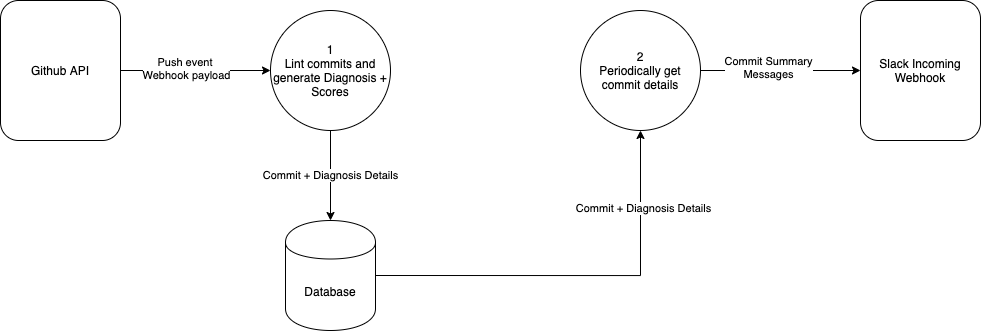

# gitlint-bot

gitlint-bot is a Github App that lints commit messages against custom rules and periodically posts a summary of these analyses in a Slack channel.

The goal of this App is to promote better and more consistent commit message style among developers in an organization.

This Github App is built using [Probot](https://probot.github.io/docs/)

## Development Setup

Requires Docker v19.03.0+

```
cp .env.example .env
docker-compose up
```

Navigate to `http://localhost:3000` and click on the `Register Github App` button.

## Publishing Packages

In order to publish a package, bump the package version and run `npm run publish`. A prompt will be shown for confirmation before the packages are published.

## Data-flow Diagram

[](https://app.diagrams.net/?lightbox=1&highlight=0000ff&edit=_blank&layers=1&nav=1&title=dfd.png#R7VjbUtswEP0aP8L4QhzyWBJKmSZtZvJQeJTtxVaRrYws58LXd2XLtyihaQsEZvoU7VpaSXv2HK9jeeN0cyPIMpnxCJjl2tHG8iaW6zr%2B8BJ%2FlGdbeUa2XzliQSM9qXUs6BNop629BY0g702UnDNJl31nyLMMQtnzESH4uj%2FtgbP%2BrksSg%2BFYhITV3vNB6%2F9BI5lov%2BOP2gdfgMaJ3vzS1TcMSPgYC15keseMZ1A9SUkdRt8yT0jE1x2Xd215Y8G5rEbpZgxMJbbOWb1ObuuDWt5VIlOGhoPD8vHnA4udYxbjvQRksrvdoXjBfPztTkzXs%2FvV4%2BzrzI%2BH96uzC2MTiDCz2uRCJjzmGWHXrfeqTBaoqDZa7Zwp50t9tp8g5VaXCSkk758cNlTedcb3KhQiWFmTjY5cGtvayKTY3nWNzipltstKq15X3U9daqd%2B2rTVieaFCOGZXLm6sImIQT4zz2tKA%2FkGPAU8D64TwIikq%2F45iC78uJnXIogDDeIfAKqJvCKs0DvNizxRKVipC6sa8Rme%2FioQOIrV6AcECeePZVa2jJNob01MSYCi0cORMBpnOA4xMgh0rEBIiqz8pB%2BkNIqqkoGcPpGgjKdQWXKayfLqgytrMGlwUgFgY%2B2RDL24JVUXwcOlbcKgo5%2FZ544GVGueV1lHw6RDz9VVOlP4w0OO5bGLY3OCv4fWNaC9oTIpAvR9mt8aoLU0VVitEyphsSRlha%2FxLbBPTPak3yDKwYx6l3Yvn46v7XVHj2v0ko4UOxf2K5FhaGRszNOUVjTAO9sTSuKM5zRXY5CEsvyUgtiK4H3nyX5BfEFh844UNv%2BUwuYZWDqmlE0rLoYlygpUgq91bE8gA0Ek7CBe1cAi5ChPJuyMYfcCv6cOyZdVS%2FNAN6oIXoJL%2FmCHS8NjueS%2BFpccsx%2F53yocStbgSEY59v4yeBtKOSanGn1cFGlK1B67FJtBnmMvvV8nP1yT4DzPQ9Ul%2BO6wx8WL994nDAxUXRPGOQjKI4UD25YK2eqm%2Bg489C48pSiO%2FHcniqOPp4mtDDY9xttoon%2BkJg5OKolmk%2F2XLeOHk8LRs%2BSzz93RjhD6l%2F%2BmhDrysM%2Fqszrs6wulb2A9IZg4koOBaJ6QpRqGW0aRveL3ChhUNJ8GjaP5o%2Bl7ITEKWC%2F26eX7g14Om0%2BxjjKO9gmj82rdom3kdsEwAei6zfA1Q7MYh80%2FDyf%2BdHXcizf8dkWz%2Fc%2BwquX2X1nv%2Bhc%3D)

## License

[Apache 2.0](./LICENSE)
